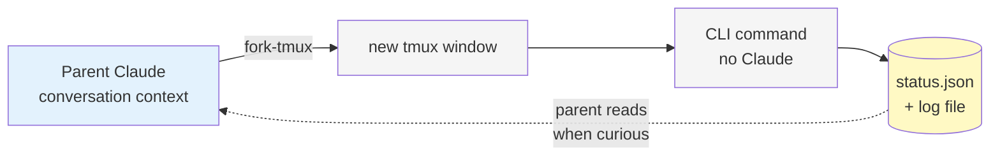
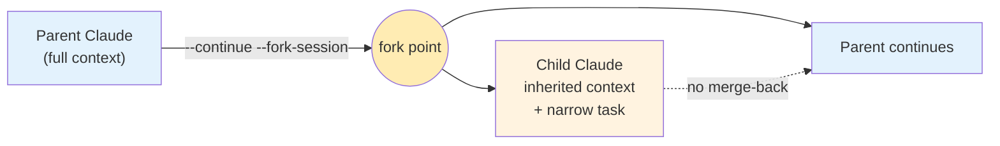
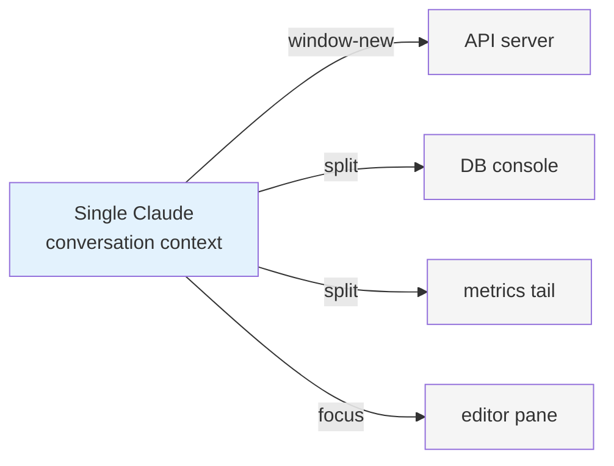
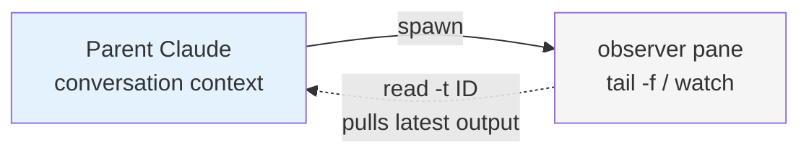
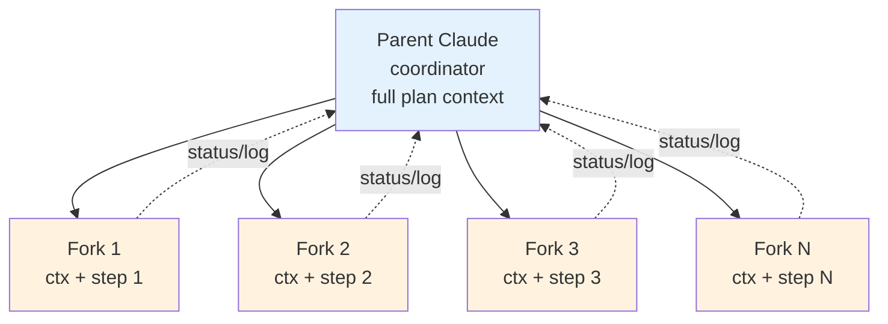
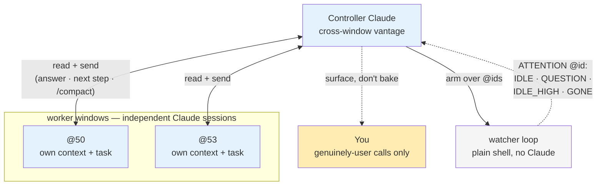
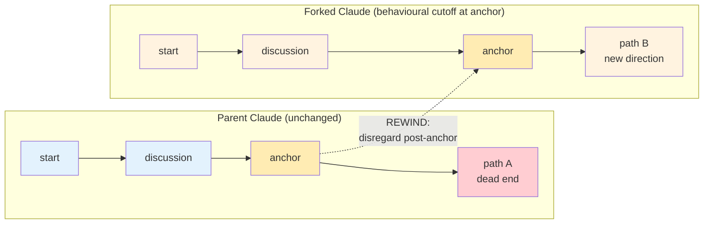
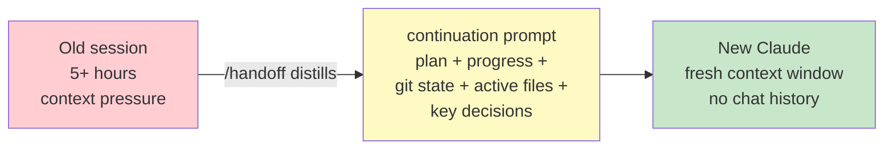
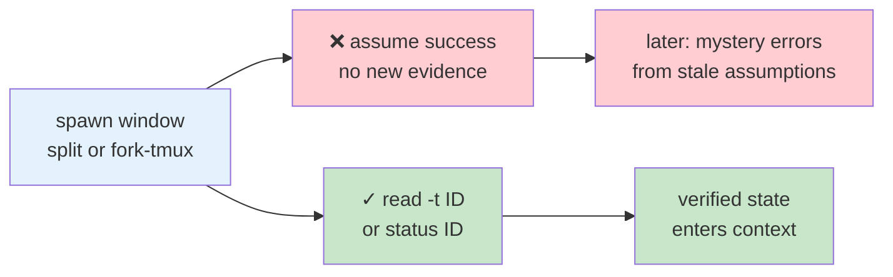

# `tmux-claude` Usage Patterns

Workflow recipes that compose the plugin's four skills (`tmux`, `fork-tmux`, `handoff`, `controller`). Nothing here is wired as automation — these are mental models for what a Claude-driven tmux unlocks once the pieces are in place. Invoke them conversationally; the skills sequence the actual tmux commands.

Each pattern ends with a context-flow diagram. Colour legend used throughout:

- 🟦 light blue — a Claude session holding conversation context
- 🟧 light orange — a forked Claude session (inherited context, separate from parent going forward)
- ⬜ light grey — a non-Claude pane (plain shell, no conversation context)
- 🟨 amber — a pivot / anchor point in the conversation
- 🟥 light red — a context-pressure or failure state
- 🟩 light green — a healthy / verified outcome
- 🟡 pale yellow — a distilled artifact (summary, continuation prompt)

## Parallel long-running jobs without blocking the chat

Kick off a build, test suite, migration, or integration run with `fork-tmux`, keep the main chat free to reason or type. Check in later via `fork_tmux.py status <id>`, read the captured log, or `wait` for completion. Works especially well when the command takes more than ~30s and you'd otherwise tab out and lose focus.

**Context:** the parent Claude context is untouched. The forked window runs a bare CLI command — no Claude inside — so the only thing that flows back is file-based status/log output that the parent pulls in on demand.

## Bounded side-task with full context ("fork session")

Spawn a second Claude in a new tmux window carrying the entire conversation so far. The child works the side task — "run the failing tests and fix them", "review this plan against the style guide", "confirm the request flow matches the API spec" — while the parent sits idle or keeps reasoning about something unrelated. The child is a real fork: its file edits apply, its context never rejoins the parent's.

**Context:** parent hands the child a full snapshot of the conversation at the fork point. From there, the two contexts diverge — there is no merge-back.

## Multi-service dev layout as a one-shot prompt

Ask Claude to compose a whole layout in a single turn: `window-new` for the API server, `split horizontal` for a DB console, another split for a metrics/log tail, then `focus` back to the editing pane. The `tmux` skill just sequences the tmux commands — you reload the same layout tomorrow by re-invoking the same prompt, which is often faster than maintaining a static tmux resurrect config.

**Context:** stays entirely in the single Claude that's orchestrating. The spawned panes are plain shells; none of them carry conversation state.

## Observer pane while you work

Keep a pane running `tail -f` on a service log, or a `watch -n 5 "npm test"` loop, while you iterate in the main pane. Because the observer pane is addressable by id, Claude can `read -t <id>` to pull in the latest output on demand — useful for "did my change surface in the logs yet?" checks without a context switch.

**Context:** parent Claude pulls observations into its own context only when it explicitly reads the pane. Context grows incrementally with real evidence, not guesses.

## Sub-agent per plan step

If you have a plan with N independent steps, `fork session` N times (with distinct slugs like `fork-step-1-migrations`, `fork-step-2-api`, …) and dispatch one step per fork. Each child inherits the full plan but only works on its slice. Gather their outputs via the status/log subcommands when they're done. The parent coordinates; the children execute in parallel tmux windows.

**Context:** each child receives a full copy of the parent context at fork time, plus a narrowing instruction. The parent remains the coordinator and consolidates results via file-based output, never by merging child contexts.

## Supervise a fleet of Claude windows (controller)

When several Claude windows are each grinding on their own task, a dedicated **controller** window keeps them unblocked so you don't babysit the tmux session yourself. The controller arms a backgrounded watcher (`watch_windows.sh @50 @53 …`) over the worker window ids; the watcher is the only thing that spins, firing a single `ATTENTION <name> (@id): IDLE | QUESTION | IDLE_HIGH | GONE` line the moment a worker reaches a point that needs a human-shaped decision. On that event the controller `read`s the pane and acts — answers the question with the best option, hands the worker its next high-impact step, `/compact`s it before it runs out of context, or coordinates a cross-window git merge — then re-arms the watcher and goes back to sleep. Only genuinely-user calls (real money, decisions that need real data) get surfaced up; everything routine the controller resolves itself.

**Context:** unlike the fork patterns, the workers are independent Claude sessions the controller never forked and whose context it never inherits — it sees only what it `read`s off each pane and steers them only by `send`ing messages that land as ordinary user input. What the controller adds is the *cross-window vantage* no single worker has (e.g. "don't merge that branch — another window holds it dirty"). High-context is handled by a commit → `/compact` → self-contained-resume handshake, and the watcher fires `IDLE_HIGH` only at a clean stop, so a compaction never strands uncommitted work. The watcher itself holds no conversation state — it's a plain shell loop.

## Rewind after a dead-end refactor

When an approach didn't pan out, `rewind to "<quoted message>"` (or describe the anchor point) forks a sub-Claude that treats the post-anchor conversation as if it never happened, then tries a different direction. The parent conversation — and your git branch — stay untouched, so you can compare the two paths side-by-side before picking one.

**Context:** the fork technically inherits the full parent transcript, but a REWIND instruction tells it to behave as if context ended at the anchor. Effectively the two Claudes now share history up to the anchor and diverge from there — two alternative timelines from the same pivot.

## Clean handoff before a context limit

At the end of a long design or exploration session, `/handoff` opens a side-by-side split, writes a self-contained continuation prompt (plan, progress, active files, key decisions, git state, branch name), and launches a fresh Claude. The new session starts with a clean context window but zero lost knowledge — the fix when replies are slowing down and you're nowhere near finished.

**Context:** this is the only pattern where conversation context is *intentionally not* carried over. Only a hand-crafted summary bridges the two sessions. The old session can be abandoned without guilt.

## Verify, don't assume, after spawning

After `window-new`, `split`, or a `fork-tmux`, read the pane (`read -t <id>` or `status <session_id>`) to confirm the process actually stayed alive. A one-shot HTTP probe or "I ran the command" isn't evidence — the wrapper script may have crashed, the CLI may have exited non-zero from a typo, the service may have died during startup. Always verify.

**Context:** the question is what evidence enters the parent's context after a spawn. Reading the pane adds verified output; skipping the read leaves an unverified assumption in context that decays into confusing failures later.

